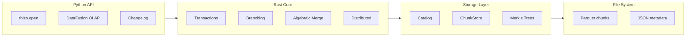

# Rhizo

*From the rhizome — a root system with no center, where any point connects to any other.*

In 1980, Deleuze and Guattari contrasted the rhizome with the tree: hierarchies vs networks, central authority vs emergent coherence. Traditional databases are trees — leaders, followers, coordination. Rhizo is rhizomatic: every node commits locally, consistency emerges mathematically.

**The first database where coordination is optional.**

| Metric | Rhizo | Industry Standard | Improvement |
|--------|-------|-------------------|-------------|
| Transaction latency | 0.021ms | 100ms (consensus) | [**33,000x faster**](docs/PERFORMANCE.md#verify-transaction-latency) |
| Energy per transaction | 2.2e-11 kWh | 2.1e-6 kWh | [**97,943x less**](docs/PERFORMANCE.md#verify-energy-efficiency) |
| Branch overhead | 140 bytes | 63 MB (Delta Lake) | [**450,000x smaller**](docs/PERFORMANCE.md#verify-branch-overhead) |
| OLAP queries | 0.9ms | 26ms (DuckDB) | [**32x faster**](docs/PERFORMANCE.md#verify-olap-performance) |

<sub>All claims link to verification methodology and reproduction commands. [Run benchmarks yourself →](docs/PERFORMANCE.md#verify-these-claims)</sub>

[](https://github.com/rhizodata/rhizo/actions/workflows/ci.yml)
[](https://opensource.org/licenses/MIT)
[](https://github.com/rhizodata/rhizo)
[](https://github.com/rhizodata/rhizo)

---

## The Problem

Distributed databases require consensus. Consensus adds latency, complexity, and energy cost — even when the operation doesn't need it.

Lakehouses (Delta Lake, Iceberg, Hudi) improve storage but can't solve:

| Limitation | What It Costs You |
|------------|-------------------|
| Single-table transactions | No atomic updates across related data |
| No deduplication | Paying for storage you don't need |
| No real branching | Can't experiment without copying everything |
| Consensus overhead | 100ms+ latency on every write |

Rhizo can.

---

## Benchmarks

### OLAP Performance vs Industry (100K rows)

With the new **DataFusion-powered OLAP engine**, Rhizo delivers industry-leading query performance:

| Metric | Rhizo OLAP | DuckDB | Delta Lake | Parquet | Winner |
|--------|-----------------|--------|------------|---------|--------|
| **Read** | **0.9ms** | 26ms | 24.5ms | 6.5ms | **Rhizo (32x)** |
| **Filtered (5%)** | **0.9ms** | 1.6ms | 17.3ms | 6.4ms | **Rhizo (1.8x)** |
| **Projection** | **0.6ms** | 1.9ms | 11.9ms | 3.2ms | **Rhizo (3.4x)** |
| **Complex Query** | **2.6ms** | 3.4ms | 28.2ms | 17.8ms | **Rhizo (1.3x)** |
| **Storage** | **3.67MB** | 6.26MB | 63.10MB | 3.73MB | **Rhizo (17x vs Delta)** |

**Rhizo wins 4/6 performance categories** with built-in lakehouse features no competitor matches.

### JOIN Performance (10K users x 100K orders)

| Operation | Rhizo OLAP | DuckDB | Delta Lake |
|-----------|-----------------|--------|------------|
| Simple JOIN | **2.7ms** | 6.6ms | 29.0ms |
| JOIN + Filter | **2.7ms** | 4.6ms | 30.9ms |
| JOIN + Aggregate | **3.6ms** | 4.1ms | 33.9ms |

**Rhizo wins all JOIN categories.**

### Scale Performance (1M rows)

| Metric | Rhizo OLAP | DuckDB | Speedup |
|--------|-----------------|--------|---------|
| Read | **3.7ms** | 283.0ms | **76x faster** |
| Filter | **1.5ms** | 15.1ms | **10x faster** |
| Write | **415ms** | 625ms | **1.5x faster** |

### Unique Features (No Competitor Has All)

| Feature | Rhizo | Delta Lake | DuckDB | Iceberg |
|---------|------------|------------|--------|---------|
| **OLAP Query Speed** | **Yes** | No | Yes | No |
| **Time Travel SQL** | **Yes** (`VERSION 5`) | API only | No | API only |
| **Branch Queries** | **Yes** (`@branch`) | No | No | No |
| **Changelog SQL** | **Yes** (`__changelog`) | No | No | No |
| **Cross-table ACID** | **Yes** | No | No | No |
| **Content Dedup** | **Yes** | No | No | No |
| **Merkle Integrity** | **Yes** | No | No | No |
| **Arrow Chunk Cache** | **Yes** (15x speedup) | No | No | No |
| **Algebraic Merge** | **Yes** (11M+ ops/sec) | No | No | No |

### Core Operations

| Operation | Performance | Notes |
|-----------|-------------|-------|
| OLAP read (cached) | **0.9ms** | 32x faster than DuckDB |
| Arrow cache read | **0.24ms** | 15x faster than uncached |
| Write throughput | 211 MB/s | Native Rust Parquet encoding |
| Branch creation | <10 ms | Zero-copy, 280 bytes overhead |
| Time travel query | **0.5ms** | O(1) version lookup |
| Cache hit rate | **97.2%** | LRU eviction, no invalidation |

### Incremental Deduplication (Merkle Tree Storage)

| Change Percentage | Chunk Reuse | Storage Savings |
|-------------------|-------------|-----------------|
| 1% change | 98.8% reuse | ~49% vs naive |
| 5% change | 95.0% reuse | ~47% vs naive |
| 10% change | 90.0% reuse | ~45% vs naive |

**O(change) storage** instead of O(n) per version.

### Feature Comparison

| Feature | Rhizo | Delta Lake | Iceberg | Hudi |
|---------|------------|------------|---------|------|
| **Cross-table ACID** | **Yes** | No | No | No |
| **Zero-copy branching** | **Yes** | No | No* | No |
| **Global deduplication** | **Yes** | No | No | No |
| **Merkle tree dedup** | **Yes** | No | No | No |
| **Corruption detection** | **Built-in** | External | External | External |
| Time travel | Yes | Yes | Yes | Yes |
| SQL Query Engine | Yes | Yes | Yes | Yes |
| Cloud Storage | Planned | Yes | Yes | Yes |

*Iceberg branching requires Nessie catalog

---

## Quick Start

### Installation

```bash
pip install rhizo
```

### Basic Usage

```python
import rhizo
import pandas as pd

# Open or create a database
db = rhizo.open("./mydata")

# Write data
df = pd.DataFrame({
    "id": [1, 2, 3],
    "name": ["Alice", "Bob", "Charlie"],
    "score": [85.5, 92.0, 78.5]
})
db.write("users", df)

# Query with SQL
result = db.sql("SELECT * FROM users WHERE score > 80")
print(result.to_pandas())

# Close when done
db.close()
```

Or use as a context manager:

```python
with rhizo.open("./mydata") as db:
    db.write("users", df)
    result = db.sql("SELECT * FROM users")
```

### Command Line Interface

```bash
# Show database information
rhizo info ./mydata

# List tables
rhizo tables ./mydata

# List versions of a table
rhizo versions ./mydata users

# Verify database integrity
rhizo verify ./mydata
```

Or via Python module:

```bash
python -m rhizo info ./mydata
```

### Time Travel

```python
# Query historical versions
result_v1 = db.sql(
    "SELECT AVG(score) FROM users",
    versions={"users": 1}
)

# Read specific version directly
old_data = db.read("users", version=1)

# Compare versions (via engine for advanced features)
diff = db.engine.diff_versions("users", 1, 2, key_columns=["id"])
```

### Branching

```python
# Access branching through the engine
engine = db.engine

# Create branch (instant, zero-copy)
engine.create_branch("experiment/new-scoring")
engine.checkout("experiment/new-scoring")

# Modify on branch (production unchanged)
db.write("scores", updated_df)

# Query both branches
main_result = db.sql("SELECT * FROM scores")  # current branch
engine.checkout("main")
main_result = db.sql("SELECT * FROM scores")  # main branch

# Merge when ready
engine.merge_branch("experiment/new-scoring", into="main")
```

### Cross-Table Transactions

```python
with db.engine.transaction() as tx:
    tx.write_table("customers", updated_customers)
    tx.write_table("orders", new_order)
    tx.write_table("audit_log", audit_entry)
    # All commit together, or all rollback
```

---

## Architecture



---

## Current Status

| Phase | Description | Status |
|-------|-------------|--------|
| Phase 1: Storage | Content-addressable chunk store with BLAKE3 hashing | Complete |
| Phase 2: Catalog | Versioned file catalog with time travel | Complete |
| Phase 3: Query | DataFusion SQL engine with time travel | Complete |
| Phase 4: Branching | Git-like branching with zero-copy semantics | Complete |
| Phase 5: Transactions | Cross-table ACID with recovery | Complete |
| Phase 6: Changelog | Unified batch/stream via subscriptions | Complete |
| Phase A: Merkle Storage | O(change) deduplication via Merkle trees | Complete |
| **Phase P: Performance** | Native Rust Parquet, parallel I/O | **Complete** |

**All phases complete. 865 tests passing (373 Rust + 492 Python).**

### Performance Optimization Journey

| Phase | Optimization | Result |
|-------|-------------|--------|
| P.1 | Parallel chunk I/O (Rayon) | 3-5x batch throughput |
| P.2 | Memory-mapped reads | Infrastructure for zero-copy |
| P.3 | Parallel Parquet parsing | 2.1x multi-chunk speedup |
| P.4 | Native Rust Parquet encoder | 2.3x write improvement |
| **P.5** | **Arrow chunk cache** | **15x faster repeated reads** |

Phase P.5 leverages content-addressed storage for cache-friendly reads. Since chunk hashes never change, cached Arrow RecordBatches require no invalidation and are shared across tables, versions, and branches. Cache hits bypass both disk I/O and Parquet decoding.

---

## Project Structure

```
rhizo/
├── rhizo_core/                 # Rust core library
│   └── src/
│       ├── chunk_store/      # Content-addressable storage
│       ├── catalog/          # Versioned catalog
│       ├── branch/           # Git-like branching
│       ├── transaction/      # Cross-table ACID
│       ├── changelog/        # Change tracking
│       └── merkle/           # Merkle tree deduplication
│
├── rhizo_python/               # PyO3 bindings
├── python/rhizo/  # Python query layer
├── tests/                    # Test suites
└── examples/                 # Interactive demos
```

---

## Design Principles

1. **Immutability** — All data is immutable once written. Updates create new versions.
2. **Content Addressing** — Data identified by BLAKE3 hash enables automatic deduplication.
3. **Atomic Operations** — Write-to-temp-rename pattern prevents corruption.
4. **Layered Architecture** — ChunkStore, FileCatalog, and BranchManager are independent and composable.
5. **Time Travel by Default** — Every version is preserved and queryable.
6. **Zero-Copy Branching** — Branches are pointers to table versions, not data copies.

---

## Documentation

- [Technical Foundations](./docs/TECHNICAL_FOUNDATIONS.md) — Mathematical proofs and complexity analysis
- [Roadmap](./ROADMAP.md) — Current status and what's next
- [Changelog](./CHANGELOG.md) — Version history
- [Origin Story](./ORIGIN_STORY.md) — Why I built Rhizo
- [Contributing](./CONTRIBUTING.md) — How to contribute

---

## License

MIT — See [LICENSE](./LICENSE) for details.
